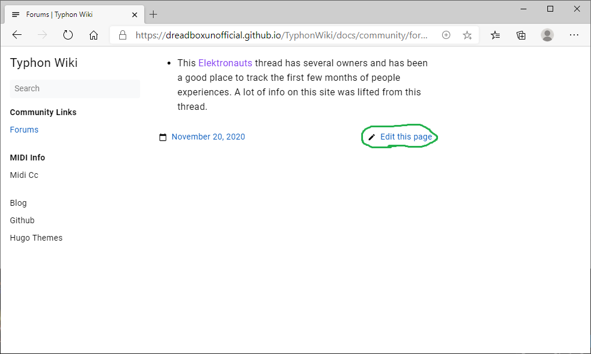

# TyphonWiki

If you're looking for the actual website - go here https://dreadboxunofficial.github.io/TyphonWiki/


If you want to contribute any documents, tips & tricks, then you're at the right place! 


## Contributing

This is a user-contributed collection of info, and anyone is welcome to contribute. At a minimum, you will need a [GitHub account](https://github.com/join) to contribute.

The site is built using [Hugo], and everything is automatically published once it's reviewed. You don't have to be a programmer to be able to make changes to it - the site uses simple [Markdown] text-based formatting.

Once you have an account created, you have two options:

1. Use the 'edit' button from the website
2. Clone this repo to your machine, test your changes using Hugo, then open up a Pull Request.

### Use the 'edit' button

First, go to the page you want to edit at https://dreadboxunofficial.github.io/TyphonWiki/ . Scroll down to the bottom of that page, and you'll find an "Edit this Page" button. Click it.



That will take you through the steps to make your own clone of the copy, edit it, and submit it for review using a Pull Request.

This GitHub doc will show you all the steps needed: 
[Editing Files in Another Users Repository]


### Using Hugo

If you're already familiar with using Git and you want to work on your own copy of the site, you can.

1. First, Get Hugo - be sure to use the extended version from the latest [Hugo Release].
1. [Fork](https://docs.github.com/en/free-pro-team@latest/github/getting-started-with-github/fork-a-repo) then clone this repo.
1. Sync the submodules by running `git submodule init` then `git submodule update`. Make sure there are files in `themes/book`

Once everything is on your machine, you can run Hugo to build the site and view it. As you save changes, your local Hugo server will re-build the page for you.

```
cd docs
hugo server --minify --theme book
```

Hugo will give a local URL as it starts up - probably http://localhost:1313/ - open that in your browser.


[Hugo]: https://gohugo.io/
[Hugo Release]: https://github.com/gohugoio/hugo/releases
[Markdown]: https://daringfireball.net/projects/markdown/
[Editing Files in Another Users Repository]: https://docs.github.com/en/free-pro-team@latest/github/managing-files-in-a-repository/editing-files-in-another-users-repository